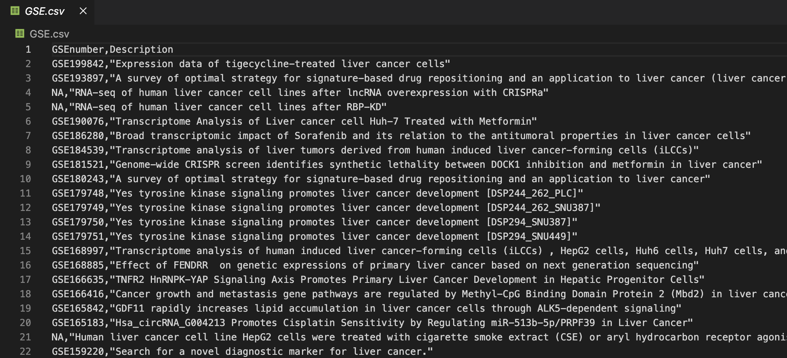

# GSEnumber_scraping
AOEの公開APIを用いて、GSE番号を簡単に調べることができるソフトウェアです。

# Usage
```
ruby collect_GSE_number.rb "Keyword" "Organism"
```
- 引数にスペースを含む場合は、""で囲んでください（例："homo sapiens")
- 出力結果は`GSE.csv`に表示されます。


